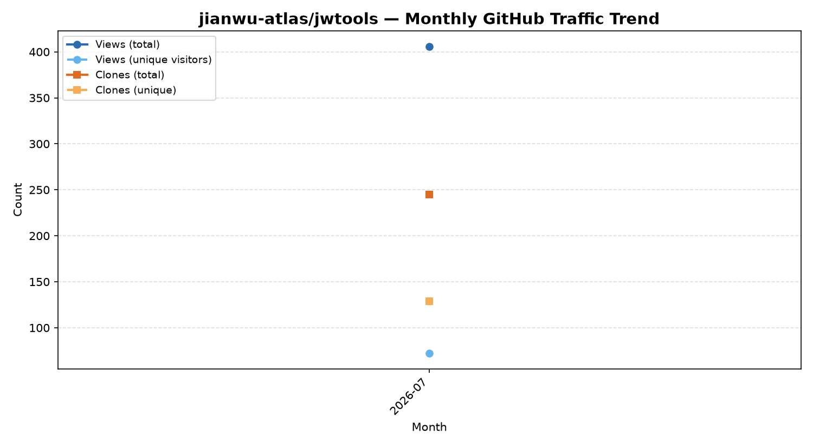

[🇬🇧 English](README.md) | [🇨🇳 中文](README-Chinese.md)

# jwtools (Jian Wu's tools) 

[](https://jackng88.github.io/index.html)


[](https://github.com/jianwu-atlas/jwtools/graphs/traffic)
[](https://github.com/jianwu-atlas/jwtools/graphs/traffic)

个人科研常用 R 小工具函数集合。

## 设计初衷

`jwtools` 的定位是**简化 bulk RNA-seq、bulk ATAC-seq、ChIP-seq、
空间转录组（10x Visium/Xenium）以及单细胞/单核测序数据的下游分析与可视化**。
不追求一次性集成所有生信方法，而是采用有机生长的方式：每当在实际项目中
写出一个有用的小工具函数，就把它规范化地加进这个包——而不是每次都在不同
脚本之间复制粘贴，久而久之出现"同一个功能好几个不一致的版本"。

长期目标是**把常用的生信分析流程整合成模块化、可复用的脚本**，做到：

- 同一套 QC / 标准化 / 可视化逻辑在不同项目、不同数据类型之间保持一致；
- 大型单细胞/空间转录组对象（例如包含 20 万+ 细胞的 `Seurat` 对象）能够
  以**内存高效**的方式保存、读取和操作；
- 让团队新成员（或者半年后的自己）能理解某个函数*为什么*这样写，
  而不只是知道*怎么调用*它。

> **当前状态（v0.2.0）：** 除了最初的 workspace 读写工具外，这个版本
> 新增了 donor-level 的**细胞类型比例分析工具**
> （`ct_proportion_analysis()`）、**dataset 来源命名标准化函数**
> （`rename_dataset_origin()`），以及**PDF+PNG 双格式图片保存辅助函数**
> （`save_dual()`）——详见下文。计划中还有针对 bulk RNA-seq、
> ATAC-seq/ChIP-seq、空间转录组以及更多单细胞分析的模块——详见
> [Roadmap](#roadmap)。

---

## 目录

- [jwtools (Jian Wu's tools) ](#jwtools-jian-wus-tools-)
  - [设计初衷](#设计初衷)
  - [目录](#目录)
  - [目前已实现的函数](#目前已实现的函数)
    - [为什么用 `.qs2` 而不是原生 R 的 `.RData`？](#为什么用-qs2-而不是原生-r-的-rdata)
  - [安装](#安装)
    - [方式一：本地安装（现在就能用，不用等发布到 GitHub）](#方式一本地安装现在就能用不用等发布到-github)
    - [方式二：放到 GitHub 后远程安装（推荐，方便服务器和电脑同步更新）](#方式二放到-github-后远程安装推荐方便服务器和电脑同步更新)
  - [使用方法](#使用方法)
  - [Roadmap](#roadmap)
  - [如何添加新函数（开发者指南）](#如何添加新函数开发者指南)
  - [依赖](#依赖)
  - [作者与联系方式](#作者与联系方式)
  - [License](#license)

---

## 目前已实现的函数

| 函数 | 作用 | 对应你原来的写法 |
|---|---|---|
| `qs_save_workspace()` | 把当前环境所有变量存成一个 `.qs2` 文件 | `save(list = ls(all=TRUE), file = "xxx.RData")` |
| `qs_load_workspace()` | 从 `.qs2` 文件恢复所有变量 | `load("xxx.RData")` |
| `ct_proportion_analysis()` | 计算 **donor-level 细胞类型比例**，在指定分组变量（如年龄组）之间进行 Kruskal-Wallis 总检验 + 两两 Wilcoxon 检验（BH校正），并生成 facet boxplot+jitter 图，可选叠加 dataset/batch 来源散点用于批次效应诊断 | 每个项目手动复制粘贴的 `rstatix`/`ggpubr` 脚本 |
| `rename_dataset_origin()` | 将 Seurat 对象 metadata 中的 `dataset_origin` 列统一标准化为 `"FirstAuthor_Year"` 引用格式 | 每次都要重写的 `case_when()`/`recode()` 对照表 |
| `save_dual()` | 一次函数调用**同时保存 `.pdf` 和 `.png`** 两种格式的图片，宽高/DPI 设置保持一致 | 两次分别调用 `ggsave()`，参数重复 |

### 为什么用 `.qs2` 而不是原生 R 的 `.RData`？

[`qs2`](https://cran.r-project.org/package=qs2) 格式采用多线程、
高压缩比的序列化后端，速度和文件体积都**明显优于**原生 R 的
`save()`/`load()`——当环境里有大型单细胞对象时（比如一个包含数万细胞、
数百个特征的 `Seurat` 对象的 `scale.data` slot），这个差距会非常明显。
这对依赖 HPC/SLURM、需要频繁保存/读取 checkpoint 的可复现单细胞分析
流程来说，直接关系到 I/O 耗时和磁盘配额这两个实际问题。

---

## 安装

### 方式一：本地安装（现在就能用，不用等发布到 GitHub）

把 `jwtools/` 文件夹放到你服务器或电脑上任意位置，然后：

```r
install.packages("devtools")   # 如果还没装过
devtools::install_local("path/to/jwtools")
```

### 方式二：放到 GitHub 后远程安装（推荐，方便服务器和电脑同步更新）

1. 在 GitHub 建一个新仓库，比如 `jwtools`
2. 把这个文件夹的内容整个传上去（结构保持不变：`DESCRIPTION`、`NAMESPACE`、
   `R/`、`man/` 等都在仓库根目录）
3. 以后在任何一台机器上：

```r
install.packages("remotes")   # 如果还没装过
remotes::install_github("jianwu-atlas/jwtools")
```

改了函数、推送到 GitHub 之后，其他机器上重新跑一次
`remotes::install_github("jianwu-atlas/jwtools")` 就能更新到最新版，
不需要手动复制文件。

---

## 使用方法

```r
library(jwtools)

# =======================================================================
# Workspace 读写
# =======================================================================

# 1. 保存整个当前工作环境
#    （等价于原生 R 的：save(list = ls(all = TRUE), file = ...)）
#    建议在分析流程的自然节点使用（比如细胞类型注释完成后、
#    正式开始差异表达分析之前）。
qs_save_workspace("core_WT_YMO_workspace.qs2", nthreads = 14)

# 2. 排除已经单独存过的大对象
#    （避免像完整 Seurat 对象这种已有独立 .qs2/.rds checkpoint 的
#    大文件被重复保存、浪费磁盘空间）。
qs_save_workspace(
  "core_WT_YMO_workspace.qs2",
  nthreads = 14,
  exclude = c("immune.combined")
)

# 3. 按正则表达式批量排除一批变量
#    （比如所有临时的 ggplot 对象 "p_xxx"、临时变量 "tmp_xxx"，
#    或者中间过程的图对象 "fig1"、"fig2" 等）。
qs_save_workspace(
  "core_WT_YMO_workspace.qs2",
  nthreads = 14,
  exclude_pattern = "^p_|^tmp_|^fig[0-9]"
)

# 4. 在同一台或另一台机器上恢复工作环境
#    （比如从 HPC/SLURM 节点迁移到本地 Mac 上继续画图）。
qs_load_workspace("core_WT_YMO_workspace.qs2", nthreads = 14)


# =======================================================================
# 细胞类型比例分析（donor-level，含两两统计检验与 dataset/batch 叠加）
# =======================================================================

res <- ct_proportion_analysis(
  seurat_obj      = immune.combined,
  celltype_col    = "Manuscript_Identity",
  sample_col      = "sample",
  group_col       = "AgeGroup_short",
  group_levels    = c("Y", "M", "O"),
  dataset_col     = "dataset_origin",
  celltype_order  = c("EC", "Epi", "B", "DC", "Mac", "Mono", "NK", "T", "Fib", "SMC"),
  celltype_colors = cols,               # 复用你主UMAP的配色向量
  output_prefix   = "28_ExtFig1F"
)

# 分别取用结果：
res$plot            # 主图 ggplot 对象（同时会自动保存 PDF+PNG）
res$prop_df          # donor-level 比例明细表（同时会自动保存 .csv）
res$kw_test          # 每个 celltype 的 Kruskal-Wallis 总检验结果
res$pairwise_test    # 每个 celltype 的两两 Wilcoxon 检验结果（BH校正）
res$stat_test         # 含画图坐标的完整统计表


# =======================================================================
# 标准化 dataset_origin 元数据
# =======================================================================

# 把原始/不一致的数据集标签统一转换成 "FirstAuthor_Year" 格式
seurat_obj$dataset_origin <- rename_dataset_origin(seurat_obj$dataset_origin)


# =======================================================================
# 同时保存 PDF 和 PNG 两种格式的图片
# =======================================================================

p <- ggplot2::ggplot(mtcars, ggplot2::aes(wt, mpg)) + ggplot2::geom_point()

save_dual(
  filename_prefix = "figures/scatter_wt_mpg",   # 不需要写扩展名
  plot            = p,
  width           = 6,
  height          = 5,
  dpi             = 300
)
# → 会同时生成 figures/scatter_wt_mpg.pdf 和 figures/scatter_wt_mpg.png
```

完整函数文档可以通过以下命令查看：

```r
?qs_save_workspace
?qs_load_workspace
?ct_proportion_analysis
?rename_dataset_origin
?save_dual
```

---

## Roadmap

以下模块是**计划中但尚未实现**的功能，反映了 `jwtools` 在作者目前
所参与的多个 atlas 项目中，长期计划覆盖的分析类型。新增的功能会先
出现在这里，合并后再移到"目前已实现的函数"部分。

| 计划中的模块 | 预期覆盖范围 |
|---|---|
| **Bulk RNA-seq 工具** | `DESeq2` design/contrast 封装、GO/KEGG 批量富集、family 级别的计数聚合、可直接发表的火山图 |
| **Bulk ATAC-seq / ChIP-seq 工具** | Peak 基因注释、差异可及性检验封装、TSS/metagene 信号谱图绘制、KRAB-ZNF 结合位点富集分析 |
| **空间转录组（10x Visium/Xenium）** | 标准化的数据加载与 QC、空间 feature/module score 叠加绘图、细胞类型解卷积可视化 |
| **单细胞/单核工具** | QC 过滤辅助函数、Harmony/Seurat v5 整合封装、基于marker的谱系注释、signed-log 版本的 `AddModuleScore()` 封装、pseudobulk 差异表达聚合 |
| **通用可视化工具** | 统一风格的 `ggplot2`/`ComplexHeatmap`/`pheatmap` 封装、跨项目一致的配色方案（同时保存 `.png` + `.pdf` 的 `save_dual()` 已在 v0.2.0 实现） |

> 每个模块都遵循同一个原则：**只有在真实分析中被使用、验证过之后**，
> 函数才会被加进这个包，确保 `jwtools` 里导出的每一个函数都是经过
> 实战检验的，而不是纸上谈兵。

---

## 如何添加新函数（开发者指南）

为了保持包结构和文档的一致性：

1. 在 `R/` 目录下新建一个 `.R` 文件（比如 `R/slim_and_save.R`），把函数写进去。
   函数上方按同样格式加 `roxygen2` 注释（`#'` 开头的那些行），写清楚
   `@param`、`@return`、`@export`——如果相关的话，再加一小段关于
   **生物学或技术原理**的说明（比如为什么模块评分要用 signed-log
   转换而不是普通 log，来处理负值报错的问题）。

2. 重新生成文档并本地测试：

```r
devtools::document()   # 根据 roxygen 注释自动生成/更新 NAMESPACE 和 man/*.Rd
devtools::load_all()   # 本地重新加载测试
devtools::check()      # 可选，检查包有没有结构性问题
```

3. 提交到 GitHub。在其他机器上重新跑一次
   `remotes::install_github("jianwu-atlas/jwtools")` 即可更新。

这样一来，`NAMESPACE` 和帮助文档都不需要手写——`devtools::document()`
会根据 roxygen 注释自动生成。

---

## 依赖

核心依赖（必需，来自 `DESCRIPTION`）：

- [`qs2`](https://cran.r-project.org/package=qs2) —— `qs_save_workspace()` /
  `qs_load_workspace()` 使用的快速多线程序列化后端
- `dplyr`、`tibble`、`tidyr` —— `ct_proportion_analysis()` 和
  `rename_dataset_origin()` 的数据整理
- `ggplot2`、`ggpubr`、`ggh4x`、`ggrepel`、`RColorBrewer`、`scales`、`grid` ——
  `ct_proportion_analysis()` 和 `save_dual()` 的绘图基础
- `rstatix` —— `ct_proportion_analysis()` 中的 Kruskal-Wallis / 两两
  Wilcoxon 统计检验
- `stats`、`utils` —— 基础 R 统计/工具函数

可选依赖（跑包测试用）：

- `testthat` (>= 3.0.0)

```r
install.packages(c(
  "qs2", "dplyr", "ggh4x", "ggplot2", "ggpubr", "ggrepel",
  "RColorBrewer", "rstatix", "scales", "tibble", "tidyr"
))
```

未来的模块（见 [Roadmap](#roadmap)）实现后会引入更多依赖，比如
`Seurat` (>= 5.0.0)、`DESeq2`、`ChIPseeker`、`Squidpy`/`Giotto` 接口，
以及 `ComplexHeatmap`。这些依赖到时候会通过 roxygen2 的
`@importFrom` 标签逐函数记录，并同步更新到 `DESCRIPTION` 中。

---

## 仓库访问统计

浏览量和克隆量通过一个定时 GitHub Action 自动追踪（见
`.github/workflows/traffic-tracker.yml`），每 10 天调用一次 GitHub Traffic
API，并把历史数据累积保存在 `traffic_report/` 中，从而突破官方 API
仅保留最近 14 天数据的限制。



---

## 作者与联系方式

**Jian (Jack Ng) Wu**
Cardio-Pulmonary Institute (CPI) & Max Planck Institute for Heart and Lung Research & DZL DataLung School

- ✉️ 邮箱：[Jian.Wu@mpi-bn.mpg.de](mailto:Jian.Wu@mpi-bn.mpg.de)
- 🌐 个人网站：[jackng88.github.io](https://jackng88.github.io/index.html)
- GitHub：[github.com/jianwu-atlas](https://github.com/jianwu-atlas)
- Google Scholar：[scholar.google.com/citations?user=-pYIKQkAAAAJ](https://scholar.google.com/citations?user=-pYIKQkAAAAJ&hl)
- ORCID：[0000-0003-4720-2374](https://orcid.org/0000-0003-4720-2374)
- LinkedIn：[linkedin.com/in/jackng833](https://www.linkedin.com/in/jackng833/)
- X (Twitter)：[@jackng831](https://x.com/jackng831)

---

## License

本项目采用 MIT License 开源协议 —— 详见 [LICENSE](LICENSE) 文件。
